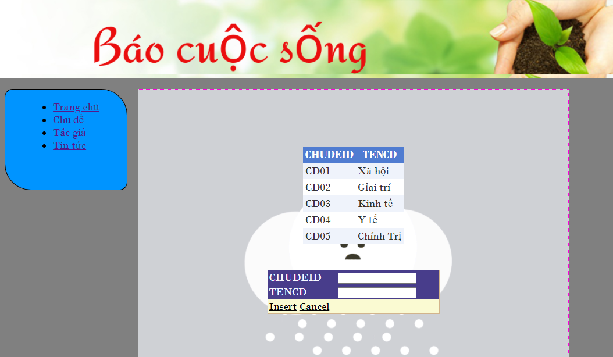

# Thi_KTM_WebTM

+ Họ và Tên: Bùi Văn Cảnh 

  + Lớp: CTT12CD3A
  
  + Thi môn:Xây dựng website thương mại
  
  + Ngày: 28/12/2020
  
## Nội dung: ##

Chạy chương trình ở file trangchu.aspx có giao diện như hình  giới thiệu về trang báo.

Để xem chủ đề ấn vào mục chủ đề ở menu lúc đó sẽ có giao diện như hình , hiển thị id chủ đề và chủ đề  , có thể thêm id và chủ đề ở mục bên dưới nhập thông tin id và tên id và ấn Insert để cập nhập .

Mục tác giả ta thấy có id tác giả tên tác giả và email tác giả có thể xóa sửa thêm .

Tin tức được hiển thị ở mục cuối, có các thông tin về id tin , id tác giả, nội dung , ngày gửi tin.

## CÁC BẢN DỮ LIỆU ##
Bảng dữ liệu sql tin tức :

Bảng dữ liệu sql chủ đề :

Bảng dữ liệu sql tác giả :

Mối quan hệ giữa các bảng :

 - ### *Ngày 23/11/2020*

      - ## *Nha Trang Copyright© B.C*
  
      - ## *D.C 0966669971*
 
      - ## *CĐKT CÔNG NGHÊ NHA TRANG*
  

 
  

